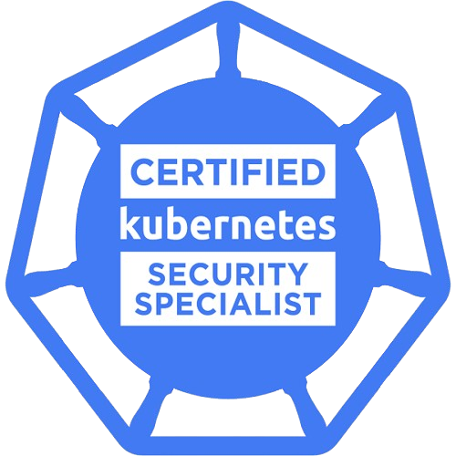
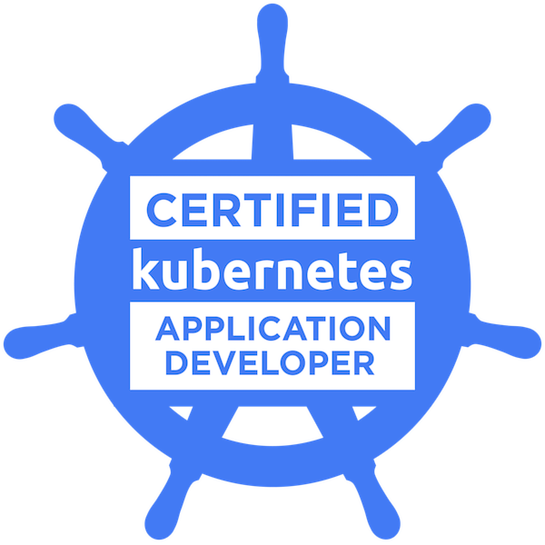
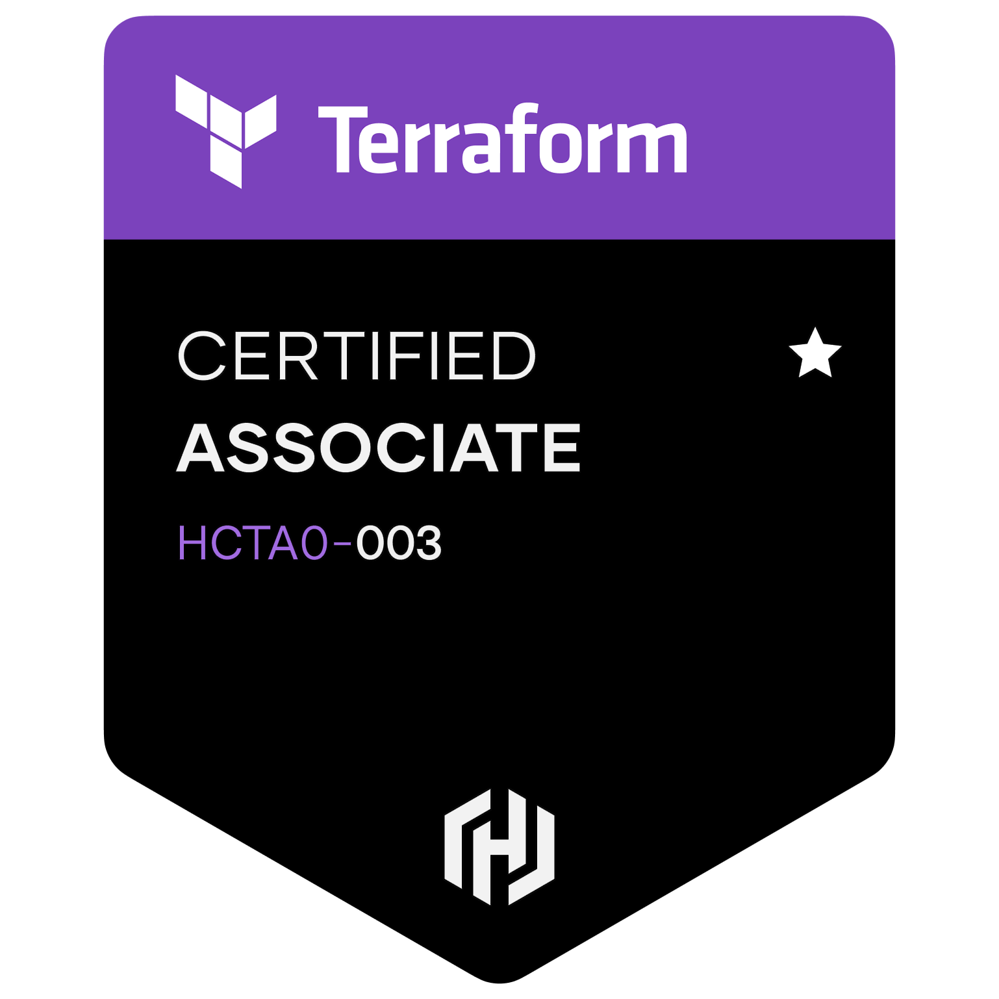
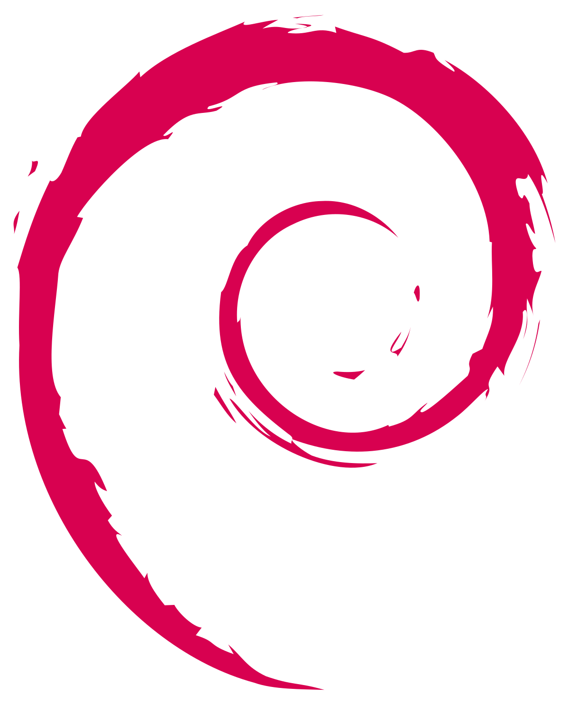
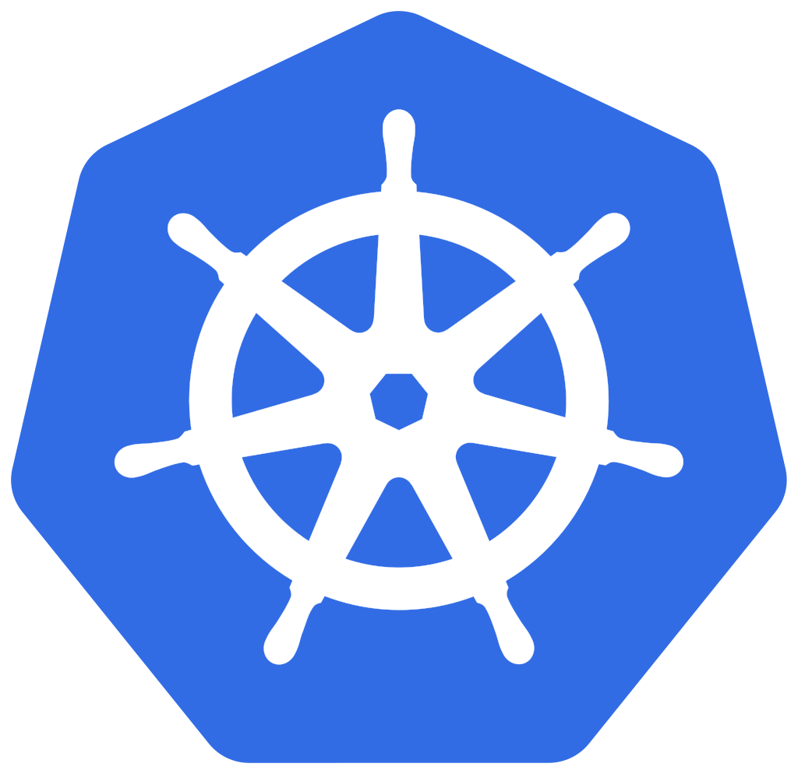
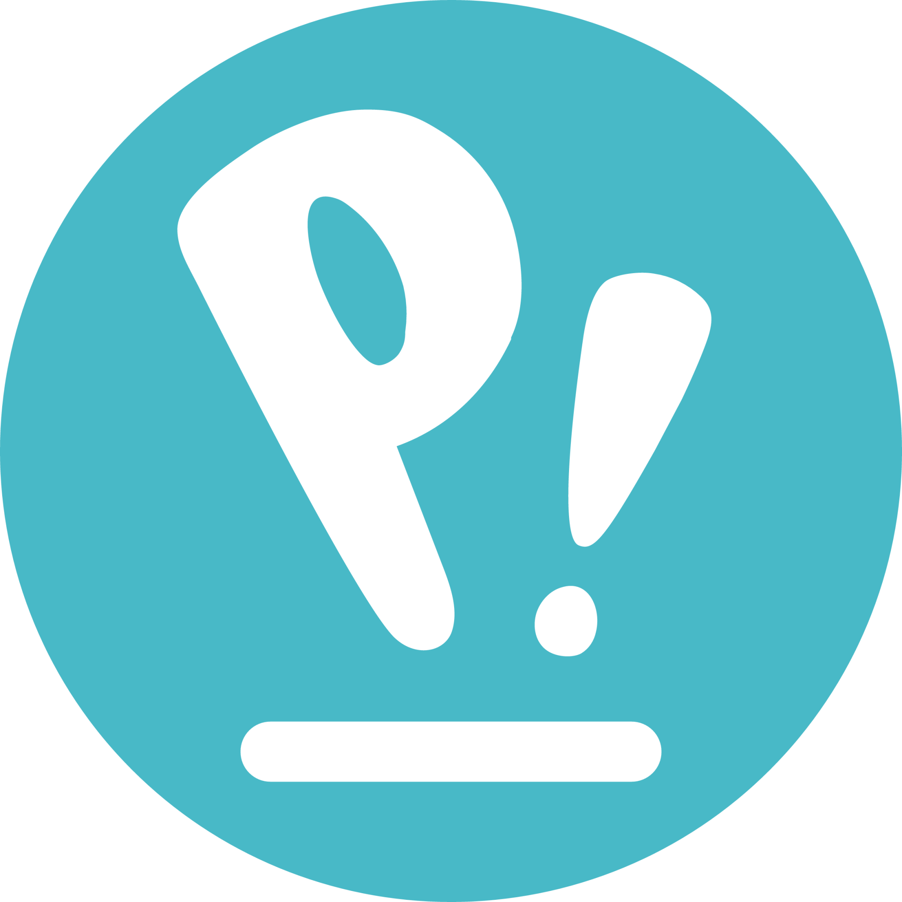

# $ whoami
DevOps and Software Engineer with hands-on experience in Kubernetes, SDLC, CI/CD automation, and security. I’ve built and maintained production infrastructure using tools like Ansible, Terraform, Helm, and Docker. My background spans backend development, DevSecOps, and automation, backed by certifications in CKA, CKS, and Terraform. I also bring experience from personal and research-driven projects across security, development, and automation.

* 🌱 I’m currently learning Go, DevOps, Kubernetes, Networking & Security
* 💬 Ask me about DevOps & Automation
* 🎨 Occasionally I make Digital Art (& animations) as well

 

---
# Certified in ...

 

---
# I work with ...

<!--  -->
... and much more 🚀

<!-- # Reach me on 📲
- [LinkedIn](https://www.linkedin.com/in/naveenbassi/)

<!--
**nav33nb/nav33nb** is a ✨ _special_ ✨ repository because its `README.md` (this file) appears on your GitHub profile.

Here are some ideas to get you started:

- 🔭 I’m currently working on ...
- 👯 I’m looking to collaborate on ...
- 🤔 I’m looking for help with ...
- 💬 Ask me about ...
- 📫 How to reach me: ...
- 😄 Pronouns: ...
- ⚡ Fun fact: ...
-->
