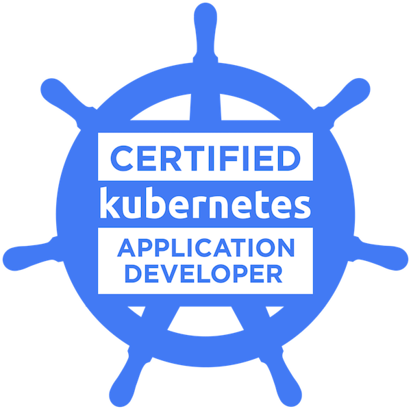
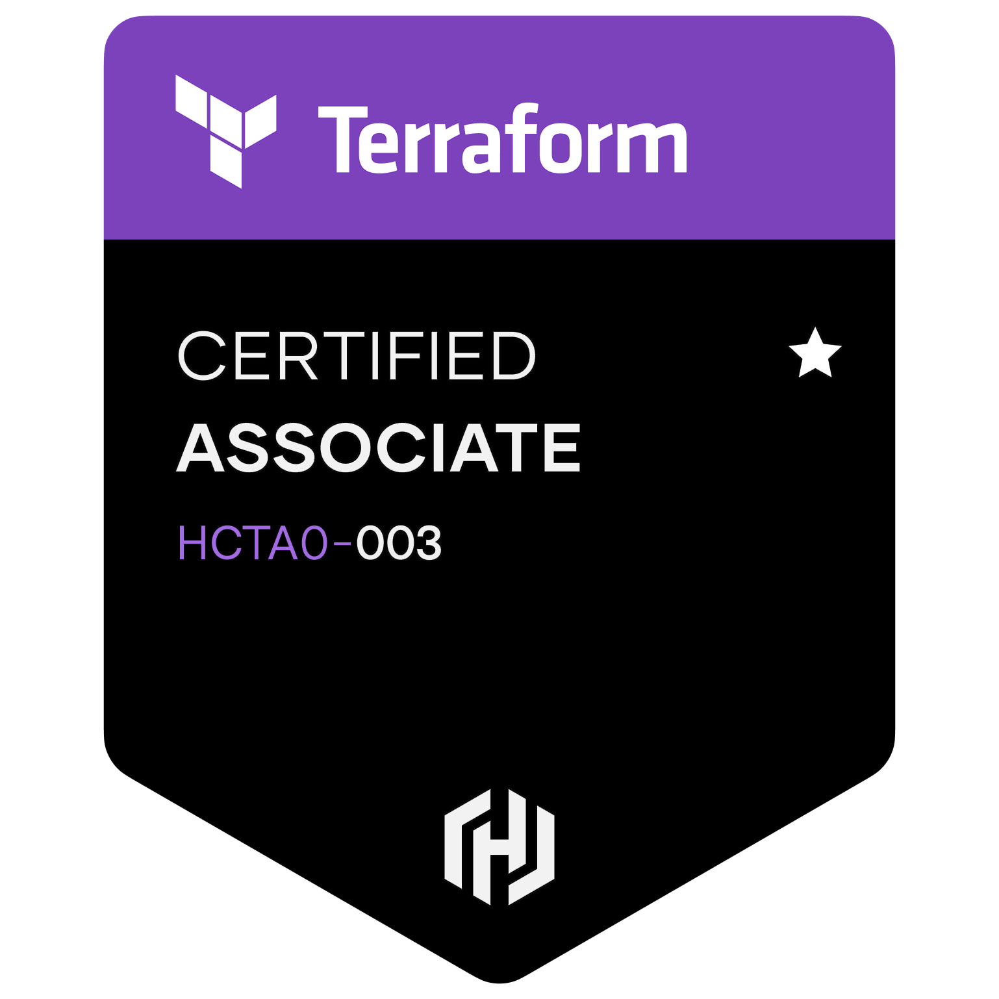

# Hello There ✌️
As a passionate computer enthusiast, I am always eager to learn about new technologies in software solutions 💻 With over 2 years of experience I have developed and deployed highly available, large-scale microservices-based solutions 
Occasionally I make Digital Art (and animations) as well 🎨

I have a wide-ranging interest in various DevOps techniques, with a focus on designing and delivering robust software solutions. Currently, I am deepening my knowledge in Ansible, aiming to gain a comprehensive understanding of the entire process of software system creation and deployment. This includes everything from provisioning and automation to configuration and deployment techniques.

- 🌱 I’m currently learning DevOps, Ansible, Networking and Security
- 💬 Ask me about Kubernetes, Docker, Terraform IaC, Automation

 

---
# I'm Certified in ...

 

---
# I work with ...
- KDE Neon
- VSCode
- Git
- Kubernetes
- Terraform
- Ansible
- Docker

... and much more 🚀

<!-- # Reach me on 📲
- [LinkedIn](https://www.linkedin.com/in/naveenbassi/)
- [Mail](mailto:naveenbassi33@gmail.com) -->
<!-- - [Instagram](https://instagram.com/nav33nb) -->

<!--
**nav33nb/nav33nb** is a ✨ _special_ ✨ repository because its `README.md` (this file) appears on your GitHub profile.

Here are some ideas to get you started:

- 🔭 I’m currently working on ...
- 👯 I’m looking to collaborate on ...
- 🤔 I’m looking for help with ...
- 💬 Ask me about ...
- 📫 How to reach me: ...
- 😄 Pronouns: ...
- ⚡ Fun fact: ...
-->
