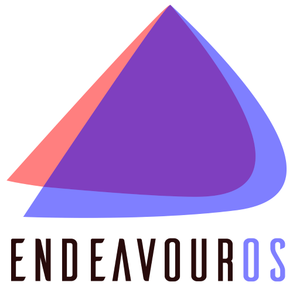
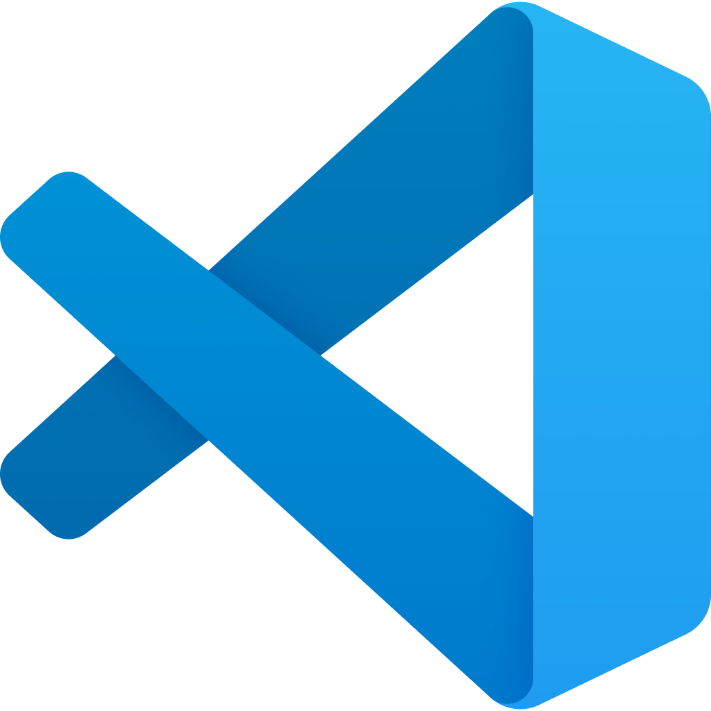
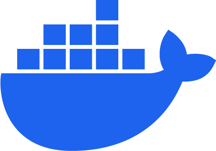
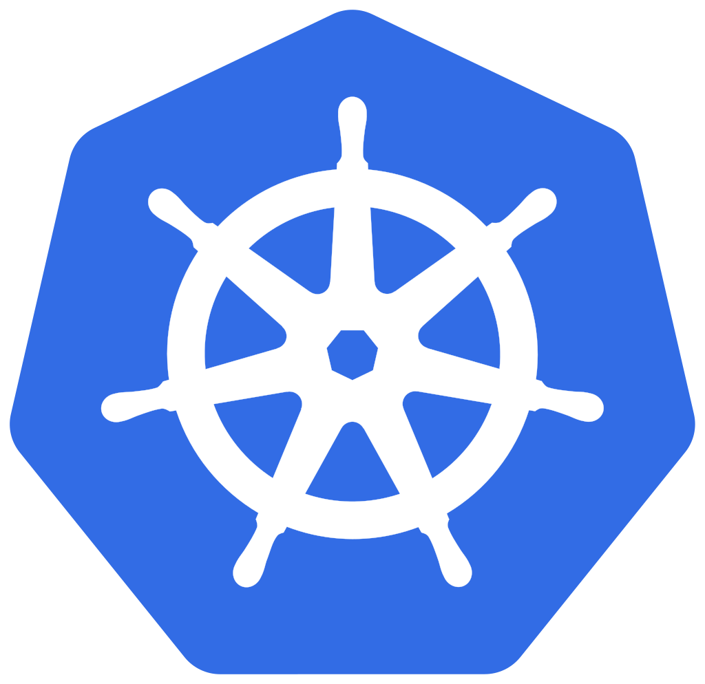

# Hello There ✌️
Passionate individual with keen interest in software solutions possessing a broad knowledge base acquired through diverse projects from software development, devops, security, and research. Formerly engaged in developing, maintaining and securing high-performing micro-services based software solutions. Currently expanding skills in Kubernetes, Networking and Automation, actively seeking new opportunities for collaboration and further work in these domains.

* 🌱 I’m currently learning DevOps, Kubernetes, Ansible, Networking & Security
* 💬 Ask me about Kubernetes, Docker, Terraform IaC, Automation
* 🎨 Occasionally I make Digital Art (and animations) as well

 

---
# I'm Certified in ...

 

---
# I work with ...

... and much more 🚀

<!-- # Reach me on 📲
- [LinkedIn](https://www.linkedin.com/in/naveenbassi/)

<!--
**nav33nb/nav33nb** is a ✨ _special_ ✨ repository because its `README.md` (this file) appears on your GitHub profile.

Here are some ideas to get you started:

- 🔭 I’m currently working on ...
- 👯 I’m looking to collaborate on ...
- 🤔 I’m looking for help with ...
- 💬 Ask me about ...
- 📫 How to reach me: ...
- 😄 Pronouns: ...
- ⚡ Fun fact: ...
-->
